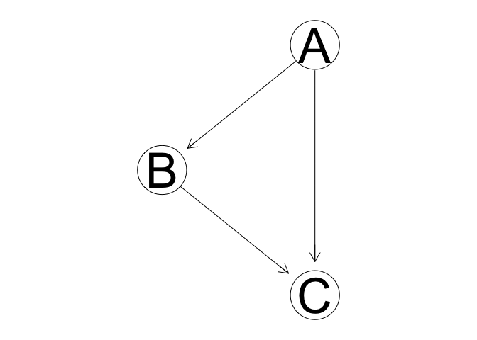

CS7290 Causal Modeling in Machine Learning: Homework 2
======================================================

For this assignment, we will once again reason on a generative model
using `bnlearn` and `pyro`. Check out the [*bnlearn*
docs](http://www.bnlearn.com) and the [*pyro* docs](http://pyro.ai) if
you have questions about these packages.

Submission guidelines
---------------------

Use a Jupyter notebook and/or R Markdown file to combine code and text
answers. Compile your solution to a static PDF document(s). Submit both
the compiled PDF and source files. The TA's will recompile your
solutions, and a failing grade will be assigned if the document fails to
recompile due to bugs in the code. If you use [Google
Collab](https://colab.research.google.com/notebook), send the link as
well as downloaded PDF and source files.

1 Causal sufficiency assumptions (part 1)
-----------------------------------------

Recall the [survey data](survey.txt) discussed in the previous homework.

-   **Age (A):** It is recorded as *young* (**young**) for individuals
    below 30 years, *adult* (**adult**) for individuals between 30 and
    60 years old, and *old* (**old**) for people older than 60.
-   **Sex (S):** The biological sex of individual, recorded as *male*
    (**M**) or *female* (**F**).
-   **Education (E):** The highest level of education or training
    completed by the individual, recorded either *high school*
    (**high**) or *university degree* (**uni**).
-   **Occupation (O):** It is recorded as an *employee* (**emp**) or a
    *self employed* (**self**) worker.
-   **Residence (R):** The size of the city the individual lives in,
    recorded as *small* (**small**) or *big* (**big**).
-   **Travel (T):** The means of transport favoured by the individual,
    recorded as *car* (**car**), *train* (**train**) or *other*
    (**other**)

We use the following directed acyclic graph (DAG) as our basis for
building a model of the process that generated this data.

Build the DAG and name it `net`.

Recall the assumptions of **faithfulness** and **minimality** that we
need to reason causally about a DAG. Let's test these assumptions.

First, run the following code block to create the `d_sep` function .

    # This is the same as the bnlearn's `dsep` function but avoids some type checking which would throw errors in this homework.
    d_sep <- bnlearn:::dseparation

The following code evaluates the d-separation statement "A is
d-separated from E by R and T". This statement is false.

    d_sep(bn = net, x = 'A', y = 'E', z = c('R', 'T'))

    ## [1] FALSE

We are going to do a brute-force evaluation of every possible
d-separation statement for this graph.

First, run the following code in R.

    vars <- nodes(net)
    pairs <- combn(x = vars, 2, list)
    arg_sets <- list()
    for(pair in pairs){
      others <- setdiff(vars, pair)
      conditioning_sets <- unlist(lapply(0:4, function(.x) combn(others, .x, list)), recursive = F)
      for(set in conditioning_sets){
        args <- list(x = pair[1], y = pair[2], z = set)
        arg_sets <- c(arg_sets, list(args)) 
      }
    }

The above code did a bit of combinatorics that calculates all the pairs
to compare, i.e. the 'x' and 'y' arguments in `d_sep`. For each pair,
all subsets of size 0 - 4 variables that are not in that pair are
calculated. Each pair / other variable subset combination is an element
in the `arg_sets` list.

For each pair of variables in the DAG, we want to evaluated if they are
d-separated by the other nodes in the DAG. The code abobe does a bit of
combinatorics to grab all pairs of variables from that DAG, and then for
each pair, calculates all subsets of size 0, 1, 2, 3, and 4 of other
variables that are not in that pair. For example, the arguments to the
above statement `d_sep(bn = net, x = 'A', y = 'E', z = c('R', 'T'))` are
the 10th element in that list:

    arg_sets[[10]]

    ## $x
    ## [1] "A"
    ## 
    ## $y
    ## [1] "E"
    ## 
    ## $z
    ## [1] "R" "T"

You can evaluate the satement as follows:

    arg_set <- arg_sets[[10]]
    d_sep(bn=net, x=arg_set$x, y=arg_set$y, z=arg_set$z)

    ## [1] FALSE

### 1.1 (4 points)

Create a new list. Iterate through the list of argument sets and
evaluate if the d-separation statement is true. If a statement is true,
add it to the list. Show code. Print an element from the list and write
out the d-separation statement in English.

### 1.2 (3 points)

Given two d-separation statements A and B, if A implies B, then we can
say B is a redundant statement. This list is going to have some
redundant statements. Print out an example of two elements in the list,
where one one element implies other element. Write both of them out as
d-separation statements, and explain the redundancy in plain English.

### 1.3 (1 point)

Based on this understanding of redundancy, how could this algorithm for
finding true d-separation statements be made more efficient?

### 1.4 (4 points)

A DAG is minimal with respect to a distribution if
*U*⊥𝔾*W*|*V* ⇒ *U*⊥*P*𝕏*W*|*V*, in
other words if every true d-separation statement in the DAG corresponds
to a conditional independence statement in the joint probability
distribution. We don't know the true underlying joint probability
distribution that generated this data, but we do have the data. That
means we can do statistical tests for conditional independence, and use
some quick and dirty statistical decision theory to decide whether a
conditional independence statement is true or false.

The `ci.test` function in `bnlearn` does statistical tests for
conditional independence. The null hypothesis in this test is that the
conditional independence is true. So our decision critera is going to
be:

> If p value is below a .05 significance threshold, conclude that the
> conditional independence statement is true. Otherwise conclude it is
> false.

    test_outcome <- ci.test('A', 'E', c('R', 'T'), .data)
    print(test_outcome)

    ## 
    ##  Mutual Information (disc.)
    ## 
    ## data:  A ~ E | R + T
    ## mi = 26.557, df = 12, p-value = 0.008945
    ## alternative hypothesis: true value is greater than 0

    print(test_outcome$p.value)

    ## [1] 0.00894518

    alpha <- .05
    print(test_outcome$p.value > alpha)

    ## [1] FALSE

Evaluate the causal minimality assumption by doing a conditional
independence test for each true d-separation statement. Print any test
results where the p-value is not greater than .05.

### 1.5 (1 point plus 2 points extra credit)

What is apparent about these these printed statements with respect to
whether or not the statement is redundant?

Extra credit (ask a statistician): Why might this issue with redundant
statements be happening?

2 Causal sufficiency (part 2)
-----------------------------

Continue with the survey DAG and data.

### 2.1 (4 points)

Now evaluate the *faithfulness* assumption is
*U*⊥*P*𝕏*W*|*V* ⇒ *U*⊥𝔾*W*|*V*, or that
every conditional independence statement that is true about the joint
distribution corresponds to a d-separation in the graph. Iterate through
the `arg_sets` list again, run the conditional independence test for
each argument set, creating a new list of sets where you conclude the
conditional independence statement is true.

### 2.2 (1 point)

Combine that analysis with the analysis from part 1. What proportion of
the true d-separation statements correspond to conclusions of
conditional independence?

### 2.3 (1 point)

What proportion of conclusions of conditional independence correspond to
true-deseparation statements?

### 2.4 (1 point)

How would these results change if we only considered non-redundant
d-separation statements?

### 2.5 (1 point)

Based on these results, how well do the faithfulness and minimality
assumptions hold up with this DAG and dataset?

3 Interventions as graph mutilation
-----------------------------------

Run the following code to build a simple three node graph.

    net <- model2network('[A][B|A][C|B:A]')
    nombres <- c('off', 'on')
    cptA <- matrix(c(0.5, 0.5), ncol=2)
    dimnames(cptA) <- list(NULL, nombres)
    cptB <- matrix(c(.8, .2, .1, .9), ncol=2)
    dimnames(cptB) <- list(B = nombres, A = nombres)
    cptC <- matrix(c(.9, .1, .99, .01, .1, .9, .4, .6))
    dim(cptC) <- c(2, 2, 2)
    dimnames(cptC) <-  list(C = nombres, A = nombres, B = nombres)
    model <- custom.fit(net, list(A = cptA, B = cptB, C = cptC))
    graphviz.plot(model)

    ## Loading required namespace: Rgraphviz

The marginal probability of A is .5.

    model$A

    ## 
    ##   Parameters of node A (multinomial distribution)
    ## 
    ## Conditional probability table:
    ##  
    ## off  on 
    ## 0.5 0.5

### 3.1 (3 points)

Given this model, use Baye's rule to calculate by hand
*P*(*A* = *o**n* | *B* = *o**n*, *C* = *o**n*). Show work.

$$
\\begin{align} 
P(A|B, C) &= \\frac{P(A,B,C)}{\\sum\_A P(A, B, C)} \\nonumber\\\\
&=\\frac{P(C|B,A)P(B|A)P(A)}{\\sum\_AP(C|B,A)P(B|A)P(A)} \\nonumber
\\end{align} 
$$

### 3.2 (3 points)

Estimate this probability using a *rejection sampling inference
algorithm*. To do this, use the `rbn` function in `bnlearn` (use `?rbn`
to learn about it) to create a dataframe with a large number of sampled
values from the model. Remove the rows where B and C are not both 'on'.
Estimate the *P*(*A* = *o**n* | *B* = *o**n*, *C* = *o**n*) as the
proportion of rows where A == 'on'. (Pro tip: Try the `filter` function
in the package `dplyr`).

### 3.3 (1 point)

Use `mutilated` to create a new graph under the intervention
do(*B* = *o**n*). Plot the new graph.

### 3.4 (3 points)

As in problem 3.1, use Baye's rule to calculate by hand
*P*(*A* = *o**n* | do(*B* = *o**n*),*C* = *o**n*). Show work.

### 3.5 (2 points)

Use the rejection sampling inference procedure you used to estimate
*P*(*A* = *o**n* | *B* = *o**n*, *C* = *o**n*) to now estimate
*P*(*A* = *o**n* | do(*B*)=*o**n*, *C* = *o**n*).

### 3.6 (6 points)

Implement this model in `pyro`. Then calculate
*P*(*A* = *o**n* | *B* = *o**n*, *C* = *o**n*) and
*P*(*A* = *o**n* | do(*B* = *o**n*),*C* = *o**n*) use the `condition`
and `do` operators and an inference algorthm.
