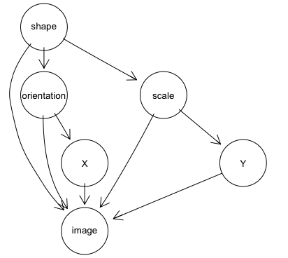
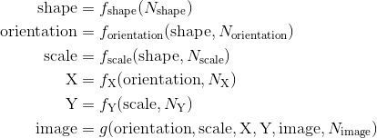

# Causality in Machine Learning: Class projects

This course focuses on the application of causal inference theory in generative machine learning.  The course project requires you to implement a cutting-edge causal machine learning workflow.

You are implementing your project in groups of 2-3 students.  The final deliverable is a Github repository that includes notebooks with code and description, and a presentation of your results to the class.

Please choose one of the following projects.

**WIP** : The following outlines some projects.  This document is a work in progress, and the instructor is in the process of adding a few more project definitions.

## Deep causal variational inference

This project is ideal for students interested in deep learning.

In this project, you will train a supervised variational autoencoder using Deepmind's [dSprites](https://github.com/deepmind/dsprites-dataset) dataset.

dSprites is a dataset of sprites, which are 2D shapes procedurally generated from 5 ground truth independent "factors." These factors are color, shape, scale, rotation, x and y positions of a sprite.

All possible combinations of these variables are present exactly once, generating N = 737280 total images.

Factors and their values:

* Shape: 3 values {square, ellipse, heart}
* Scale: 6 values linearly spaced in (0.5, 1)
* Orientation: 40 values in (0, 2π)
* Position X: 32 values in (0, 1)
* Position Y: 32 values in (0, 1)

There is a sixth factor for color, but it is white for every image in this dataset.

The purpose of this dataset was to evaluate the ability of disentanglement methods.  In these methods, you treat these factors as latent and then try to "disentangle" them in the latent representation.

However, in this project, you will not treat these factors as latent, and include them as labels in the model training.  Further, you will invent a causal story that relates these factors and the images in a DAG such as in the following figure:

 

You would implement this causal story as a structural causal model of the form:

The image variable will be a 64 x 64 array.  The noise term for the image variable will be the traditional Gaussian random variable. The structural assignment *g* for the image variable will be the decoder.

### Deliverables

* Create a DAG and an SCM articulate a causal story relating shape, orientation, scale, X, Y, and the data.
* Resample the dataset so you get a new dataset with an empirical distribution that is faithful to the DAG and is entailed by the SCM (instructor will provide guidance).
* Using Pyro, implement the causal VAE.  The instructor will provide you with a notebook that implements a primitive version of the model, including code for setting up data loaders, reshaping of tensors, and the learning algorithm.  The instructor will provide you with guidance on how to incrementally expand this model.
* Use the trained model to answer some counterfactual queries, for example, "given this image of a heart with this orientation, position, and scale, what would it have looked like if it were a square?"

## Counterfactual policy evaluation with Open AI gym

This project is ideal for students who are interested in reinforcement learning.

In this project, you will take an environment from [OpenAI gym](https://gym.openai.com/) and demonstrate a counterfactual evaluation use case.

### Deliverables

* Select an environment with a discrete state and action space (e.g. the frozen lake models)
* Reimplement the transition function in this environment as a structural causal model.  Use the technique described in class and in the reference below.
* Create two policies for this environment. You can train them using a standard RL algorithm.  Alternatively, you can make the policy up, though it should still be a sensible policy; for example in the frozen lake environment, you could make up a policy that always tries to take a step that minimizes the distance to the goal but still tries to avoid holes.
* Pretend this policy was in production, and generate logs.
* With the second policy, use counterfactual evaluation with the structural causal model to evaluate how well the second policy would have performed had it been in production.  Compare the counterfactual expectation of reward, to the expected reward of the in-production model.

[Counterfactual Off-Policy Evaluation with Gumbel-Max Structural Causal Models](https://arxiv.org/abs/1905.05824)

## Causal modeling of a dynamic system

This project is ideal for students who are interested in doing applied causal machine learning in these fields, such as economics, game theory, computational ecology, and systems biology.  

In these fields, it is standard to use mathematic models of how the behavior of a system evolves in time (e.g., ordinary differential equations) to model dynamic systems.  However, modelers are often interested in how an intervention causes a system to behave at equilibrium -- where the system dynamics have stabilized.  For example, in economics, there are differential equations that define the rate of change of price given supply and demand.  However, an economist is generally interested predicting the effect of an intervention on supply (e.g., through a tariff) will affect the price of a product at equilibrium, they are less concerned with predicting exactly how the intervention will cause the price to fluctuate before reaching equilibrium.

Another basic example is predator-prey modeling.  Imagine we want to predict how a rabbit population control policy will affect local ecology.  Suppose that in this ecology, the only predator of rabbits is foxes, and we are concerned that rabbit-hunting might adversely affect the fox population.

To model this system, we could model the rate of change in the rabbit population and the rate of change in the fox population.   Our causal reasoning would emerge in how we specified these rates of change.  For example, we could say that rabbit birth rate depends on the current population of rabbits; in causal terms, this means that the presence of rabbits causes the birth of more rabbits.  Similarly, we could say that the rabbit death rate is proportional to the current population of rabbits times the current population of foxes (i.e., the number of potential rabbit-fox interactions); in causal terms, this says that the presence of rabbits and foxes causes the death of rabbits.

The challenge is using a causal Bayesian network (CBN) or a structural causal model (SCM) to capture the equilibrium of such a system.  Imagine our rabbit population control policy kept the rabbit population fixed at a specific value "x" (e.g., we took away a rabbit each time one were born, and added a rabbit each time one died).  We would model this intervention by changing the dynamic model so that the rabbit population was constant at "x".  At the same time, we apply the intervention do(R = x) to the equilibrium CBN or SCM.  Ideally, we would the CBN or SCM in such a way that when the dynamic model reached equilibrium, the number of foxes would be the same as the predicted number given by the CBN/SCM under intervention.  It turns out that specifying a CBN or SCM that can do this is non-trivial.

### Deliverables

1. Use Pyro to implement the Gillespie algorithm on a simple three molecule biochemical model.  The Gillespie algorithm is a probabilistic way of modeling dynamic interactions between molecules.  The instructor will provide the model and algorithm pseudocode.
2. Use Pyro code to model the same system as a structural causal model.  The instructor will provide the model and the pseudocode.
3. Use the `do` operator to compare interventions on both models, and analyze the conditions under which the model interventions match and the conditions under which the model interventions differ.

## Schema network proof-of-concept

This project is suitable for those interested in applying causal modeling and causal discovery to reinforcement learning.

[Schema networks](https://www.vicarious.com/2017/08/07/general-game-playing-with-schema-networks/) are a model-base reinforcement learning approach proposed by Vicarious AI.

In this task you will implement a basic proof-of-concept of the object-oriented Markov decision processes described in section 3.2 in the [reference paper](https://www.vicarious.com/wp-content/uploads/2017/10/icml2017-schemas.pdf).  The object here is too implement the basic modeling abstractions.  You are not expected to provide an implementation sophisticated enough to model the Atari games described in the reference.

### Deliverables
* Provide a well-organized and well-documented repository of schema network extractions.
* Transition function must be represented as Pyro programs
* Students will be judged on Python code-quality and quality of modeling abstractions.
* Provide a notebook illustrating a run of a toy schema network model as a proof-of-concept

## Causal bandits (WIP)

Causal reasoning in the context of bandit algorithms and general online learning systems.

## Counterfactual fairness (WIP)

Implementation of a SCM-based counterfactual fairness evaluation on the COMPAS dataset.

Zhang, Junzhe, and Elias Bareinboim. "Equality of opportunity in classification: A causal approach." Advances in Neural Information Processing Systems. 2018.

## Potential online learning and RL applications (WIP)
* [Causal reasoning from meta-reinforcement learning](https://arxiv.org/pdf/1901.08162v1.pdf)
* [Schema networks](https://www.vicarious.com/2017/08/07/general-game-playing-with-schema-networks/)
* Icard, Thomas, Fiery Cushman, and Joshua Knobe. ["On the instrumental value of hypothetical and counterfactual thought."](https://philarchive.org/archive/ICAOTI) (2018).