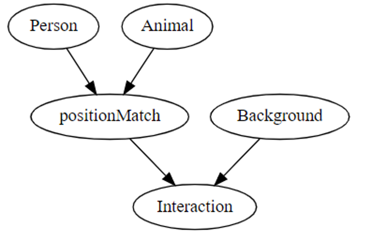

# Object Oriented Models for Causal Scene Generation

## Authors

[Junmei Luo](https://www.linkedin.com/in/junmei-luo/), [Boya Zhang
](https://www.linkedin.com/in/boya-bella-zhang/)

## Abstract

In this course - CS 7290: Causal Machine Learning - we have been learning to reflect on a data generating process and represent it with a causal model. However, if we take a [vision-as-inverse-graphics](https://ps.is.tuebingen.mpg.de/research_fields/inverse-graphics) view of computer vision, we could think of captions as a natural language representation of the data generating process that generated the accompanying image.

Our project is to take these natural language descriptions and turn them into the basic ingrediates of a probabilistic programs, and then convert it into a picture. In this project, we designed an object-oriented causal effect model which can generate a reasonable image from the model result. The structure of the object-oriented causal effect model is inspired by [Practical Probabilistic Programming](https://dl.acm.org/doi/book/10.5555/3033232) Chapter 7.

[See video abstract](https://youtu.be/a0Q6gF46Lmg)

## Introduction

In the causal model, we have 2 agents: a person and an animal. There are some interactions between them and the interaction is conditioned on their position(internal) and the background / environment(external). Condition or intervention on their attributes will affect the final generated image.

Here are the attributes of each class: <br>
Person： position1， haircolor， hairlength， gender， age <br>
Animal： position2, color, size, type <br>
Background： background <br>
Interaction： interaction

Here is the DAG for this model.



The probability distribution are defined based on the logic showed in the DAG: the postions of two entities and the background will determine their final interactions. The positions can be left or right indicates they are in the left part of right part of the background.<br> 
In our definition, there are four types of interations: 'fight','hold', 'chase', and 'call'. 'fight' and 'hold' occur when they have the same postion while 'chase' and 'call' occur only if they have different positions.<br>
Their interaction is also limited by the environment they are in, which is the background of our final generated image. They can't 'hold' each other in the park and they can't 'chase' each other at home.

The causal model uses `pyro` to generate samples and forms captions like the following;

    A old female with black long hair fights a little black cat in the park.
    A young female with golden short hair holds a little grey cat at home.
    A young male with black long hair calls a little brown dog in the park.
    A young male with golden long hair fights a little black cat in the park.

Then a picture will be generated using some simple elements.

## How to explore this project

There is one jupyter notebook: **OOP-Scene-Generation** and two folders in this project: a **/pic** folder which includes the basic input images we have and a **/generatedPic** which includes all the final images generated.

* **OOP-Scene-Generation**: all project details are included in the jupyter notebook which can be used as a tutorial. The project can be run directly using the jupyter notebook with pre-installed packages mentioned below in **Reproducibility** part.

* **/pic** folder: the input entity and background images are in this folder and their names have to match what the values are in jupyter notebook.

* **/generatedPic** folder: all the pictures generated from the code will be saved as .png file in this directory by default named with their descriptions. 

### Presentation

There is a **built-in user interface** in the project. Users can select the variables and values that they want to condition or intervent on. The user interface generation function (userInterface()) needs to be run once to get the variable_choices window. After it is generated, users can change the values of the selected variables and click on the corresponding button everytime they want to get a new picture. The variable selection window are shared by all the buttons, so please make sure that correct values are selected before the image generation.


### Reproducibility
#### External Libraries
This project requires the following external packages that need to be installed.

* `graphviz` is for visualize the causal DAG.
```python
pip install graphviz #conda install graphviz
```
Note: if there are errors, you might need to set up your local PATH.


* `torch`, `pyro`, `numpy` are for causal models and data processing.
```python
pip install torch
pip install pyro
pip install numpy
```

* `ipython`, `ipywidgets` are for user interface.
```python
pip install ipython
pip install ipywidgets
```

* `pil` is to modify images/pictures.
```python
pip install pil #pip install Pillow
```

#### Possible Extensions
- **Change the initial probability distribution of causal model**<br>
Just modify the `prob` dictionary in the beginning part of `OOP-Scene-Generation.ipynb`.
- **Use your own pictures**<br>
You can change the picture elements in `/pic`. They should match the values of gender, type and background in the alias. The image type has to be .png or .jpg. If there are both .png and .jpg file with the same name, .png file will be used by default.
