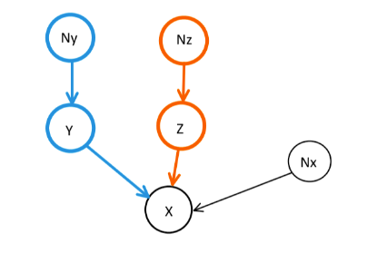
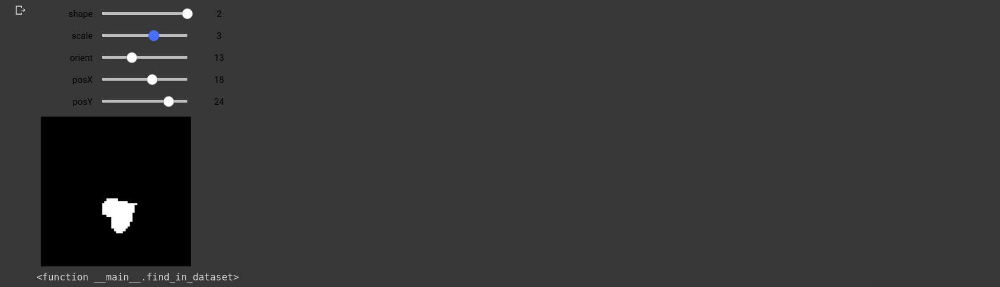
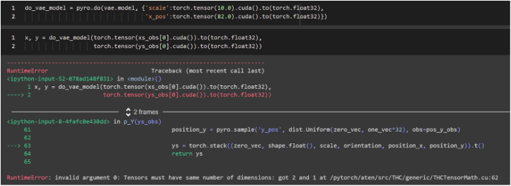
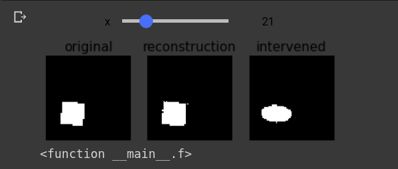
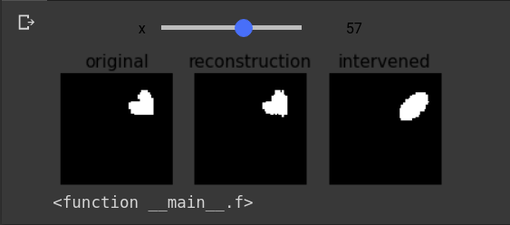
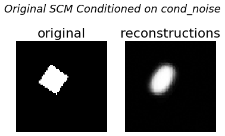
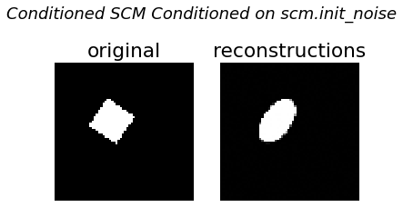
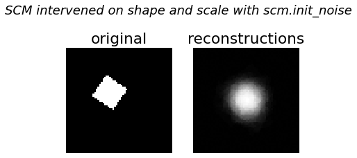
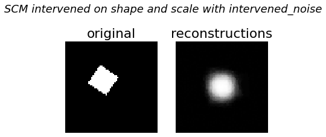
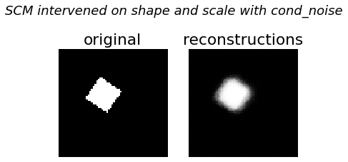

[](https://colab.research.google.com/drive/12x0ziUq_3UcirdJmPUYuhfWKA9lM_3Nv?authuser=1#scrollTo=qb5tktzq-6zT)

# Causal Modeling with a Variational Autoencoder

This Project aims to refactor the original code from the variational autoencoder on Deepmind's dSprites dataset.

## Authors
Shaw Wen, Nikson Panigrahi

## Installation

Use the package manager [pip](https://pip.pypa.io/en/stable/) to install foobar. (Already included in included colab notebook)

Install the following libraries:
* Pyro
* Pytorch
* tqdm
* pydrive

## Abstract
The objective of this project is to create a deep causal relationship between the images and the 6 ground truth independent factors that aggregately determine an image, and see how conditioning on the independent factors can affect the turnout of the images. To do this, we first create and train a variational autoencoder whose purpose is to 1.) compute or estimate the latent variable (Z) from observed variables (X and Y) where X comprises matrices of tensors representing images and Y comprises the 6 ground truth independent factors.  Z is the latent variable that's obtained from mu and sigma, both of which are computed from observed variables X and Y using vae's encoder.  2.) Infer images (X) from the latent variable Z and a given set of ground truth independent factors Y using vae's decoder. Once the VAE is ready, we then create a structural causal model whose DAG can be seen in *Figure 1*.  The SCM allows us to define relationship between the images and the ground truth factors and draw latent factor from the relationship, which in turn enables us to make inferences about images based on intervened SCMs and to observe the effect of changing independent factors on the images.  And all of these together ultimately enable us to perform counterfactuals using abduction, action, and prediction from our artifact deep causal structural model.

[](https://www.youtube.com/watch?v=PyT120SLAI4)


## Project Walkthrough
### Causal Variational Autoencoder

As mentioned above, the first step in the process is to create a CVAE bewteen the images and the 6 ground truth independent factor, which are color, shape, scale, orientation, posX, and posY.  The deep learning structure that we’re using is variational autoencoder, and the causal structure that we’re assuming is as follows:


*Figure 1*

Here we assume our exogenous variables to be Ny and Nx where Nx and Ny are taken from observations.  The variable Z is estimated from a normal distribution with mean and deviation composed of zeros and ones tensors with shapes determined by the batch size of X observations (Nx) and dimension of Nz (arbitrarily assigned).  The variable Y, which comprises shape, scale, orientation, x_pos, and y_pos, is computed or estimated from various distributions from the original Y observations (Ny).  And finally X is estimated from a Bernoulli’s distribution with a probability of success (1) that is estimated from the model’s decoder which takes in the X observations (raw data), estimated Z and Y from earlier, as arguments.  The CVAE model outputs as a result estimated X and Y.

The following code defines the Structure of the VAE model (for more details refer notebook)

```python
def model(self, xs_obs, ys_obs):
			pyro.module("cvae", self)
			batch_size = xs_obs.size(0)
			options = dict(dtype=xs_obs.dtype, device=xs_obs.device)
			zero_vec = torch.zeros([batch_size], **options)

			def p_Z():
					prior_loc = torch.zeros(batch_size, self.z_dim, **options)
					prior_scale = torch.ones(batch_size, self.z_dim, **options)
					zs = pyro.sample("z", dist.Normal(prior_loc, prior_scale).to_event(1))
					return zs
				
			def p_Y(ys_obs):
					num_shapes = 3
					one_vec = torch.ones([batch_size], **options)
					shape_probs = torch.ones([batch_size, num_shapes], **options)  # 3 shapes
					orientation_probs = torch.ones([batch_size, 40], **options)  # 40 orientation vals
					
					_, shape_obs, scale_obs, orient_obs, pos_x_obs, pos_y_obs = ys_obs.t()

					# sample the shapes
					shape = pyro.sample('shape', dist.Categorical(probs=shape_probs), obs=shape_obs.int())
					scale = pyro.sample('scale', dist.Uniform(zero_vec, one_vec*40), obs=scale_obs)
					orientation = pyro.sample(
							'orientation',
							dist.Uniform(zero_vec, one_vec*40),
							obs=orient_obs
					)
					position_x = pyro.sample('x_pos', dist.Uniform(zero_vec, one_vec*32), obs=pos_x_obs)
					position_y = pyro.sample('y_pos', dist.Uniform(zero_vec, one_vec*32), obs=pos_y_obs)

					ys = torch.stack((zero_vec, shape.float(), scale, orientation, position_x, position_y)).t()
					return ys

			def f_X_obs(ys, zs, xs_obs):
					# if the label y (which digit to write) is supervised, sample from the
					# constant prior, otherwise, observe the value (i.e. score it against
					# the constant prior)
					loc = self.decoder.forward(zs, self.p_Y_onehot(ys))
					xs = pyro.sample("x", dist.Bernoulli(loc).to_event(1), obs=xs_obs)
					return xs

			with pyro.plate("data"):
					zs = p_Z()
					ys = p_Y(ys_obs)
					xs = f_X_obs(ys, zs, xs_obs)
					return xs, ys
```
### Training the VAE
Once the model and guide functions are set up, we proceed to training the model with a learning rate of 0.001, num_epochs of 10, and test_frequency of 5.  For optimization, we use an adaptive learning rate optimization algorithm called Adam. The dataset consists of training and testing part of the dataset made in the form of generator functions, which generates the training and testing data when called. The training has been done on the training part of the dataset on Google Colab platform on GPU resource. After the VAE has been trained, the weights have been saved, which can be used again so as to avoid re-training of the model. From the results the average test loss was 39.1669, and the average training loss was 31.4489, which could be further improved but would be sufficient for the scope of this project.

### Conditioning on the Causal VAE (CVAE)
The CVAE class contains the structure for the causal model which is made by three variables X, Y, Z as mentioned previously. It also contains a reconstruct image() function which generates the variable X based on the observed values of X, Y, Z. Once the model is trained, before we proceed to condition the model, to confirm our VAE is working, we implement the interact function with shape, scale, orientation, posX, and posY to generate images.  As shown below, the successful generation of image verifies that our CVAE is functional.


*Figure 2*

Once our VAE.model is verified functional, we proceed to condition the vae.model on the variables color, shape, scale, orientation, posX, posY, to see how images would be altered or changed based on the conditioned model.  It took couple attempts before we could get our conditioned model to generate samples properly. 

##### *First Attempt*

Our initial attempt was to condition the model directly by using the exogenous variable names such as ‘scale’, ‘color'.  Unfortunately, the method did not work because when we tried to generate samples from the conditioned model, we'd get an error indicating a shape/size mismatch in the argument.  We surmise that the application of do operation on the original CVAE model might have changed the way parameters need to be passed to the modified model.  In the interest of time, we decided to use a different approach...


*Figure 3*

##### *Second Attempt*

The second approach we exploited is by first loading the data to be conditioned, before passing them to the pyro.do operator, we loop through the data to manually fix the values of the variables that we wish to fix, and then pass the entire modified or conditioned datasets as a whole into the do operator along with the original CVAE model.  Luckily, the second approach worked for us.


#### *Image Regeneration from Conditioned CVAE*
For regenerating images from the conditioned CVAE model, we use the test dataset.  And by intervening on the shape parameter and setting it to 1 which represents oval shape, we see from Figure 5 and Figure 6 that the shape retains its value while other parameters are the same.

_*Snippet for Intervention:*_
```python
cond_data['shape'] = torch.tensor([1. for _ in cond_data['shape']]).cuda()
conditioned_model = pyro.do(vae.model, data=cond_data)
```


*Figure 5*


*Figure 6*


### Structural Causal Model with a VAE
This class contains various abstractions about utilizing VAE in terms of structural causal model, the structural causal model makes use of various Exogenous variables: N_Y_(num), N_x and N_z, it also contains abstractions for auto conditioning on the model if the model has been intervened and trains it based on those parameters 

The SCM class takes in a pre-trained VAE (from above), mu, and sigma (both of which are computed by VAE) as arguments to create an instance of itself.  The SCM class utilizes VAE's decoder to map back to or regenerate xs given ys and an estimated zs calculated by VAE's encoder from given observations.  Please refer to *Figure 1* for a DAG of this SCM.  

```python
def  __init__(self, vae, mu, sigma):
	"""
	Constructor
	Intializes :
	image dimensions - 4096(64*64),
	z dimensions: size of the tensor representing the latent random variable z,
	label dimensions: 114 labels y that correspond to an image(one hot encoded)
	f(x) = p(x|y,z)
	Noise variables in the model N_#
	"""
	self.vae = vae
	self.image_dim = vae.image_dim
	self.z_dim = vae.z_dim
	# these are used for f_X
	self.label_dims = vae.label_shape
```

The code below defines the structure of the SCM, please refer back to *Figure 1* for its DAG. As shown below, the model requires noise to be initiated, but noise can be initiated without conditioned noise by using SCM's self.init_noises...

```python
def  model(noise):
	"""
	The model corresponds to a generative process
	args: noise variables
	return: X(image), Y(labels), Z(latents)
	"""
	N_X = pyro.sample(  'N_X', noise['N_X'].to_event(1)  )
	# denoted using the index in the sequence
	# that they are stored in as vae.label_names:
	# ['shape', 'scale', 'orientation', 'posX', 'posY']
	N_Y_1 = pyro.sample(  'N_Y_1', noise['N_Y_1'].to_event(1)  )
	N_Y_2 = pyro.sample(  'N_Y_2', noise['N_Y_2'].to_event(1)  )
	N_Y_3 = pyro.sample(  'N_Y_3', noise['N_Y_3'].to_event(1)  )
	N_Y_4 = pyro.sample(  'N_Y_4', noise['N_Y_4'].to_event(1)  )
	N_Y_5 = pyro.sample(  'N_Y_5', noise['N_Y_5'].to_event(1)  )
	
	# Z ~ Normal(Nx_mu, Nx_sigma)
	N_Z = pyro.sample(  'N_Z', noise['N_Z'].to_event(1)  )
	Z = pyro.sample('Z', dist.Normal( f_Z( N_Z ),  1e-1).to_event(1)  )

	Y_1 = pyro.sample('Y_1', dist.Normal( f_Y(N_Y_1),  1e-2)  )
	Y_2 = pyro.sample('Y_2', dist.Normal( f_Y(N_Y_2),  1e-1)  )
	Y_3 = pyro.sample('Y_3', dist.Normal( f_Y(N_Y_3),  1e-1)  )
	Y_4 = pyro.sample('Y_4', dist.Normal( f_Y(N_Y_4),  1e-1)  )
	Y_5 = pyro.sample('Y_5', dist.Normal( f_Y(N_Y_5),  1e-1)  )

	# X ~ p(x|y,z) = bernoulli(loc(y,z))
	X = pyro.sample('X', dist.Normal( f_X(  (Y_1, Y_2, Y_3,Y_4,Y_5), Z, N_X ),  1e-2).to_event(1))

	# return noise and variables
	noise_samples = N_X,  (N_Y_1, N_Y_2, N_Y_3, N_Y_4, N_Y_5), N_Z
	variable_samples = X,  (Y_1, Y_2, Y_3, Y_4, Y_5), Z

	return variable_samples, noise_samples
```
_*Snippet for SCM.init_noise:*_
```python
#Initialize all noise variables in the model
self.init_noise = {
	'N_X'  : dist.Uniform(torch.zeros(vae.image_dim), torch.ones(vae.image_dim)),
	'N_Z'  : dist.Normal(torch.zeros(vae.z_dim), torch.ones(vae.z_dim)),
	'N_Y_1'  : dist.Uniform(torch.zeros(self.label_dims[1]),torch.ones(self.label_dims[1])),
	'N_Y_2'  : dist.Uniform(torch.zeros(self.label_dims[2]),torch.ones(self.label_dims[2])),
	'N_Y_3'  : dist.Uniform(torch.zeros(self.label_dims[3]),torch.ones(self.label_dims[3])),
	'N_Y_4'  : dist.Uniform(torch.zeros(self.label_dims[4]),torch.ones(self.label_dims[4])),
	'N_Y_5'  : dist.Uniform(torch.zeros(self.label_dims[5]),torch.ones(self.label_dims[5]))
}
```
### Instantiating SCM

The code below calculates mu and sigma from observed data and use them along with vae to create an instance of SCM

```python
# ox <= [imgs], y <= [labels]
ox, y = get_specific_data(cuda=True)
plot_image(ox)
# Pass it through VAE to get q(z|x) => N(mu, sigma)
mu, sigma = vae.encoder_z.forward(ox,vae.remap_y(y))
# Feed these params to our custom SCM
scm = SCM(vae, mu.cpu(), sigma.cpu())
```
### Conditioning SCM with a VAE
Once we have an instance of SCM, in this context, we name it 'scm'.  Apply *pyro.condition* to modify the model and update its noise variables accordingly using *scm.update_noise_svi*.

```python
cond_data = {}
for i in  range(1,  6):
	cond_data["Y_{}".format(i)] = torch.tensor(y[0,i].cpu()).to(torch.float32)
	print(cond_data)

cond_data['Y_1'] = torch.tensor(1.)
cond_data['Y_2'] = torch.tensor(4.)
conditioned_model = pyro.condition(scm.model, data=cond_data)

# updating latent variables with conditioned observations
cond_noise = scm.update_noise_svi(cond_data)
```

What the *scm.update_noise_svi* method does is recalculating the latent factors mu and sigma with the newly provided noise (conditioned data) and update the model with this new set of noise.  Given the length of the code, please refer to the source code file for detailed implementation of the method.

Just out of curiosity, we decide to try generating images with both the original and the conditioned models on both conditioned and scm self initiated noise datasets.

##### *Regenerating images with the original SCM on conditioned noise*

```python
rxs = []
for i in  range(100):
	(rx,ry,_), _ = scm.model(cond_noise)
	rxs.append(rx)

compare_to_density(ox, torch.cat(rxs))
```



*Figure 7*

##### *Regenerating images with the conditioned SCM on scm.init_noises*
```python
rxs = []
for i in  range(100):
	(rx,ry,_), _ = conditioned_model(scm.init_noise)
	rxs.append(rx)

compare_to_density(ox, torch.cat(rxs))
```


*Figure 8*

According to Figure 7 and Figure 8, the image generated by the original scm.model on cond_noise turns out to be a blurred oval whereas the image generated by the conditioned scm.model on *scm.init_noise* is a much crisper oval shape.  We surmise this may be due to an higher degree of freedom or standard deviation that exists within the cond_noise than that within the scm.init_noise.  The cond_noise in the original scm.model not only shapes and scales the image but it also causes the image to be blurry, the blurriness could be possibly due to a wider deviation among the noise data in cond_noise.  As for the image generated by the conditioned model on scm.init_noise, the image is much crisper, our hypothesis for the cause of this is that the noise data created by scm.init_noise does not contain much deviations among each other and therefore produce almost identical data through the 100 samples that in turn generate a much crisper image.   

### SCM Counterfactual - *Abduction, Action, and Prediction*
Finally, we perform counterfactual on the SCM with a VAE by putting together everything that we've created from above.

#### *Abduction & Action*
In this step, we create our intervened model by fixing shape and scale to 0 and 3 respectively and update the model noise with respect to the data used to intervene the model.

```python
# intervening on Shape, posX and PosY
intervened_model = pyro.do(scm.model, data={
	"Y_1": torch.tensor(0.),
	"Y_2": torch.tensor(3.),
})
noise_data = {}

for term, d in cond_noise.items():
	noise_data[term] = d.loc
	
intervened_noise = scm.update_noise_svi(noise_data, intervened_model)
```

#### *Predicting images with intervened SCM on scm.init_noise*
Given that our intervened model is conditioned on Y_1 = 0.0 and Y_2 = 3.0, below is the image that the intervened model would generate if we were to condition the intervened model on scm.init_noise
```python
rxs = []
for i in  range(100):
	(cfo1,ny1,nz1), _= intervened_model(scm.init_noise)
	rxs.append(cfo1)
	
compare_to_density(ox, torch.cat(rxs))
_ =plt.suptitle("SCM intervened on shape", fontsize=18, fontstyle='italic')
```


*Figure 9*


#### *Predicting images with intervened SCM on intervened_noise*
Given that our intervened model is conditioned on Y_1 = 0.0 and Y_2 = 3.0, below is the image that the intervened model would generate if we were to condition on the intervened noise which is estimated from the intervened_data = {Y_1 = 0.0, Y_2 = 3.0}
```python
rxs = []
for i in  range(100):
	(cfo1,ny1,nz1), _= intervened_model(intervened_noise)
	rxs.append(cfo1)
	
compare_to_density(ox, torch.cat(rxs))
_ =plt.suptitle("SCM intervened on shape", fontsize=18, fontstyle='italic')
```


*Figure 10*


#### *Predicting images with intervened SCM on conditioned noise*
Given that our intervened model is conditioned on Y_1 = 0 and Y_2 = 3, below is the image that the intervened model would generate if we were to condition on cond_noise which is estimated from the cond_data = {Y_1 = 1.0, Y_2 = 4.0}
```python
rxs = []
for i in  range(100):
	(cfo1,ny1,nz1), _= intervened_model(cond_noise)
	rxs.append(cfo1)
	
compare_to_density(ox, torch.cat(rxs))
_ =plt.suptitle("SCM intervened on shape", fontsize=18, fontstyle='italic')
```


*Figure 11*


## Contribution
This project is a joint contribution of Shaw Wen and Nikson Panigrahi as a part of CS7290 curriculum at Northeastern University, further contributions using pull requests are welcome.

## License
[MIT](https://choosealicense.com/licenses/mit/)
