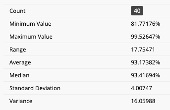

# Causal Modeling in Machine Learning: Northeastern U. Course

CS 7290 Special Topics in Data Science

Prof. Robert Osazuwa Ness

Northeastern University, Khoury College of Computer Sciences

This Northeastern University syllabus for Causal Modeling in Machine Learning course.  The schedule is subject to adjustment.  Please check frequently to stay updated.  Video lectures and readings should be read/viewed prior to class.

## What are the prerequisites?

Prerequisites include (DS5220 and DS5230) or (CS6140 and CS6220) or approval of the instructor.

You will gain the most from this course if you:

* You are familiar with random variables, joint probability distributions, conditional probabilities distributions, Baye's rule and basic ideas from Bayesian statistics, and expectation.
* You a good software engineer or aspire to be one.
* You work in or plan to work on a team running experiments in a top-tier tech company or a technically advanced retail company.
* You plan on working as an ML/AI research scientist and want to learn how to create agents that reason like humans.

## Online Course Materials and Readings

Students will be provided access to the online course at Altdeep.ai. Students should go through the online course in advance of class.  This will increase the quality of the classes and allow you to absorb more during class time.

The online lectures provide links to external papers for more in-depth readings.  Students are expected to read the assigned readings in advance of each lecture.

Learning to read papers is a skill that needs practice.  Check out [the three pass method](https://web.stanford.edu/class/ee384m/Handouts/HowtoReadPaper.pdf) or simply Google "how to read a paper" to learn more. 

If you are the type to buy a book for easy reference, the following two books will cover most of the content in this course in one way or another:
* Pearl, Judea, Madelyn Glymour, and Nicholas P. Jewell. Causal inference in statistics: A primer. John Wiley & Sons, 2016.
* Peters, Jonas, Dominik Janzing, and Bernhard Schölkopf. Elements of causal inference: foundations and learning algorithms. MIT Press, 2017.

## Grading and Academic Guidelines

The final grade for this course will be weighted as follows:

    Homework: 55%
    Participation: 10%
    Course Project: 35%

Here are some final grade statistics from a previous semester.

Refresh your knowledge of the university's [policy](http://www.northeastern.edu/osccr/academic-integrity-policy/) about academic integrity and plagiarism (this includes plagarizing code). There is **zero-tolerance** for cheating!

## Homework

The homework in this class will consist of 5 problem sets, which will combine mathematical derivations with programming exercises in Python. Submissions must be made via blackboard by 11.59pm on the due date.

Homeworks are due on Sundays before 11:59pm EST through Canvas.

| Homework | Date Assigned | Date Due     |
|----------|---------------|--------------|
| HW1      | TBA           | TBA          |
| HW2      | TBA           | TBA          |
| HW3      | TBA           | TBA          |
| HW4      | TBA           | TBA          |

## Participation

Participation is a fundamental part of then grade. As an online course, the primary ways of gaining participation points include interacting in the online forum. "Interaction" means starting and participating in course-content-related conversations, as well as asking and answering questions.

To put it another way, you want to make sure the professors and TAs know you by name by the end of the class.

We take participation seriously.  This course is designed to prepare you to work in teams and to communicate modeling assumptions to key stakeholders in an organization.  You cannot build these skills without participating in active discussion.  Do NOT take this course if you are unwilling to actively participate.  Also, a "phoning it in" (敷衍了事) approach won't work either.

## Project

The goal of the project is to gain experience in implementing, testing, and presenting one of the methods covered in the lectures. Students will collaborate in groups of 2-4. 

We will provide a list of project subscriptions.  Students who want to pursue a unique project should speak to the instructor.  Unique projects done in collaboration with a company are encouraged.

See past-student projects in the projects directory to get an impression of what projects look like. 

## Curriculum

View the [curriculum](https://www.altdeep.ai/p/causal-ml) on the course page.
