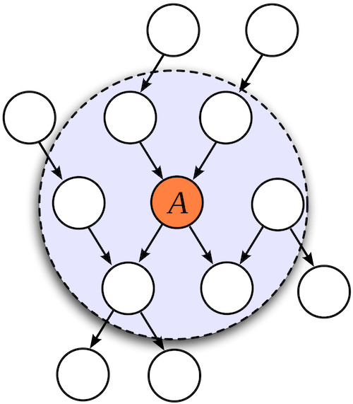

```{r setup, include=FALSE}
knitr::opts_chunk$set(echo=TRUE, warning=FALSE, message=FALSE)
knitr::opts_chunk$set(fig.path="../fig/")
library(bnlearn)
library(Rgraphviz)
```

# Overview of a Transportation Survey Data Set

## Data description
This data set contains information about usage of different transportation systems with a focus on cars and trains for different social groups. It is comprised of categorical variables with the following names and values:

- **Age (A):** The age of the individual, recorded as *young* (**young**) for individuals below 30 years, *adult* (**adult**) for individuals between 30 and 60 years old, and *old* (**old**) for people older than 60.

- **Sex (S):** The biological sex of individual, recorded as *male* (**M**) or *female* (**F**).

- **Education (E):** The highest level of education or training completed by the individual, recorded either *high school* (**high**) or *university degree* (**uni**).

- **Occupation (O):** It is recorded as an *employee* (**emp**) or a *self employed* (**self**) worker.

- **Residence (R):** The size of the city the individual lives in, recorded as *small* (**small**) or *big* (**big**).

- **Travel (T):** The means of transport favoured by the individual, recorded as *car* (**car**), *train* (**train**) or *other* (**other**)

Travel is the *target* of the survey, the quantity of interest whose behaviour is under investigation.

```{r, surveyNet, fig.width=3, fig.height=3, fig.align='center'}
# empty graph
dag <- empty.graph(nodes = c("A","S","E","O","R","T"))
arc.set <- matrix(c("A", "E",
                    "S", "E",
                    "E", "O",
                    "E", "R",
                    "O", "T",
                    "R", "T"),
                  byrow = TRUE, ncol = 2,
                  dimnames = list(NULL, c("from", "to")))
arcs(dag) <- arc.set
nodes(dag)
arcs(dag)
graphviz.plot(dag)
```

# Key Graphical Concepts in DAGs

Whenever we use graphs in an analytical context, it is because it is useful to use graphical language and algorithms to reason about the problem.

The same is true in causal generative modeling. Here we introduce a few key concepts and some ```bnlearn``` abstractions applying them. In the next section we show how to use these concepts to reason about the data generating process we wish to model.

**V-structure:** A **collider** or a **V structure** is a V-motif formed by a node and two incoming parents. When the parents are connected, this is called a "moral" V-structure (because the parents are "married") and when they are not it is called an immoral V-structure. Less prudish terminology includes "open/closed V-structure" and "shielded/unshielded collider".

```{r, echo=FALSE, fig.cap="V is a collider", fig.align="center"}
collider_net <- empty.graph(nodes = c("A","B","V"))
arc.set <- matrix(c("A", "V",
                    "B", "V"),
                  byrow = TRUE, ncol = 2,
                  dimnames = list(NULL, c("from", "to")))
arcs(collider_net) <- arc.set
graphviz.plot(collider_net)
```

You can find all the **V structures** of a DAG:

```{r}
vstructs(dag)
```

Note that conditioning on a collider induces dependence
even though the parents aren't directly connected.

**Markov blanket:** The Markov blanket of a node is comprised of its parents, children and children's other parents. In other words, it is comprised of its parents, children, and any other members of V-structures to which it belongs. In the figure below, all the nodes inside the circle are Markov blanket of node A.


```{r markovBlanket, cache = FALSE, echo = FALSE, fig.width=7, fig.height=6, fig.align = "center", fig.cap="Figure 1: Markov blanket of node A are the nodes inside the circle."}

```

In R, we can find the Markov blankets of a node, by using the ```mb``` function from **bnlearn**.

```{r}
#Markov blanket of node E in survey data set
mb(dag, node = "E")
```


**D-separation:** The nodes in the DAG correspond to random variables, and we usually represent random variables with capital levels like $X$ and $Y$. Let's put random variables aside for now an think purely in terms of nodes, and denote them with small letters liked u and v. Let's use capital letters to represent sets of nodes.

Let P be an undirected path (that is, a path which can go in either direction) from node u to v. Note that a path is just a set of nodes. Then the path P is said to be d-separated by a set of nodes Z if and only if (at least) one of the following holds:

* P contains a chain, i → m → j, such that the middle node m is in Z

* P contains a chain, i ← m ← j, such that the middle node m is in Z

* P contains a fork, i ← m → j, such that the middle node m is in Z

* P contains an inverted fork (or collider), i → m ← j, such that the middle node m is not in Z and no descendant of m is in Z.

Thus u and v are said to be d-separated by Z if all undirected paths between them are d-separated. In Figure 2, u is d-separated from v given m and k (Z = {m,k}), because P (u - i - m - j - v) contains a chain (i → m → j)m such that the middle node m in in Z. 

```{r dSep1, echo=FALSE, fig.cap="Figure 2: u is d-separated from v given m and k", fig.align = "center", fig.show="hold",fig.width=4, fig.height=4}
dag1 <- empty.graph(nodes = c("u","v","i","j","m","k"))
arc.set1 <- matrix(c("u", "i",
                    "i", "m",
                    "m", "j",
                    "j", "v",
                    "m", "k"),
                  byrow = TRUE, ncol = 2,
                  dimnames = list(NULL, c("from", "to")))
arcs(dag1) <- arc.set1
graphviz.plot(dag1)
```

In Figure 3, u is d-separated from v given l (Z = l), because P (u - i - m - j - v) contains an inverted fork (or collider), i → m ← j, such that the middle node m is not in Z and no descendant of m is in Z.

```{r dSep2, echo=FALSE, fig.cap="Figure 3: u is d-separated from v given l", fig.align = "center", fig.show="hold",fig.width=4, fig.height=4}
dag2 <- empty.graph(nodes = c("u","v","i","j","m","k","l"))
arc.set2 <- matrix(c("u", "i",
                    "i", "m",
                    "j", "m",
                    "j", "v",
                    "m", "k",
                    "i","l"),
                  byrow = TRUE, ncol = 2,
                  dimnames = list(NULL, c("from", "to")))
arcs(dag2) <- arc.set2
graphviz.plot(dag2)
```


We can investigate whether two nodes in a **bn** object are d-separated using
the **dsep** function. **dsep** takes three arguments, x, y and z, corresponding to
$\textbf{X}$, $\textbf{Y}$ and $\textbf{Z}$; the first two must be the names of two nodes being tested for d-separation, while the latter is an optional d-separating set. So, for example,

```{r}
dsep(dag, x = "S", y = "R")
dsep(dag, x = "O", y = "R")
dsep(dag, x = "S", y = "R", z = "E")
```


# Conditional Independence and the Markov Property

We use the graphical concepts in the previous section to reason about the data generating process we want to model. Specifically, the graphical concepts represent assumptions of **conditional independence** in the joint distribution over all the variables in the process.

## Why we care about conditional independence in machine learning and causality

1. In machine learning, if a prediction target is conditionally independent of some set of variables B given a set of variables A, then you should only at variables A to your predictive model. Adding B along with A would be overfitting.

2. Conditional independence gives us more compact representations of the probability distribution captured by our causal generative model. The more conditional independence statements are true, less parameter values need to be trained and stored.

3. Conditional independence is why causal models are most robust and transfer more easily across domains. Changes that affect one part of the model do not affect other parts.

Let's revisit the concepts that we learned in the previous section:

**V-structure: ** We will start by talking about a simple example. Look at the figure below with three nodes. There is a grass that is either wet or dry, the sprinkler is either on or off and the weather is either rainy or not rainy. This network has a V-structure. In general, rain and sprinkler are independent from each other but when we condition on the child (grass), rain and sprinkler become dependent. If we know that the grass is wet, finding out it is not raining tells you the sprinkler must be on.

**Markov blanket: ** A node is conditionally independent of all the other nodes in the system given its Markov blanket. This means that if you predict that node, given the nodes in the Markov blanket, adding any other predictors to your model is overfitting, because the Markov blanket contains all the information available about the node.

**D-separation and the Markov property: ** We have a data generating process with a joint distribution $P_X$ over all the variables ($\{X_1, X_2, ..., X_P\}$) in our DAG $G$. The global Markov property is a property of G. It means that all of the d-separations in $G$, correspond to conditional independence assumptions in $P_X$. When we build a causal model that has an underlying causal DAG, we generally assumes the DAG meets the global Markov property. Let's define Markov property: Given a DAG G and a joint distribution $P_X$, this distribution is said to satisfy,

(a) The **global Markov property** with respect to G, if,

$$X_i  { \!\perp\!\!\!\perp}_{G} X_j  | X_k \Rightarrow X_i  { \!\perp\!\!\!\perp} X_j  | X_k$$
This means that if two node are conditionaly d-separated in G, they are conditionaly independent with respect to their joint probability distribution. 

(b) The **local Markov property** with respect to G, if each variable $X_i$ is independent of its non-descendants given its parents, and

(c) The **Markov factorization property** with respect to G, if,

$$p(X) = p(X_1,X_2,...,X_p) =  \prod_{j=1}^{p} p(X_j|Pa_j^G)$$

Where $Pa_j^G$ is the set of parents of node (variable) $X_j$. If a DAG has the Markov factorization property with respect to a distribution, then the distribution factorizes according to the ordering of the DAG.

In R, we can use the ```dsep``` function from bnlearn package to find whether two variables are dseparated given a set of variables. Here is an example from survey data. We want to check whether S is independent of T given O and R:

```{r}
dsep(dag, "S", "T",c("O","R"))
```

Now, let's check whether the global Markov property is satisfied in this example. We will use the survey data to check the Null hypothesis that  S is independent of T given O and R. In R, we can use ```ci.test``` function from bnlearn to find conditional dependence.

```{r}
surveyData <- read.table("../data/survey.txt", header = TRUE)
ci.test("S","T",c("O","R"), data = surveyData)
```

As you can see, the p-value is greater that 0.05 threshold, hence we do not reject the Null hypothesis and conclude that in fact, S is independent of T given O and R.

**Faithfulness assumption:** A distribution $P_X$ is faithful to the DAG G, if,

$X_i  { \!\perp\!\!\!\perp} X_j  | X_k \Rightarrow X_i  { \!\perp\!\!\!\perp}_{G} X_j  | X_k$

In the simple example above, we can see that from the data distribution, S is independent of T given O and R (we checket it with ```ci.test```) and hence in the network S is d-separated of T given O and R. So we have a faithful distribution.

Finally, let's compute the factorization of the survey data:

$p(X) = p(A,S,E,O,R,T) =  p(A)p(S)p(E|A,S)p(O|E)p(R|E)p(T|O,R)$

In R, we can use the ```modelstring``` function from bnlearn package to find the factorization of a graphical model.

```{r}
modelstring(dag)
```


# Some Useful References
1. Scutari, Marco, and Jean-Baptiste Denis. Bayesian networks: with examples in R. Chapman and Hall/CRC, 2014.

2. Peters, Jonas, Dominik Janzing, and Bernhard Schölkopf. Elements of causal inference: foundations and learning algorithms. MIT press, 2017.
